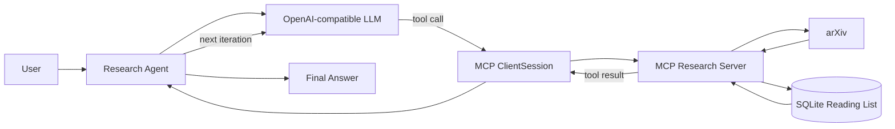

# MCP Research Assistant

A small agentic research assistant built with the **Model Context Protocol (MCP)**, an OpenAI-compatible LLM endpoint, arXiv, and SQLite.

The project demonstrates the full loop from dynamic MCP tool discovery to multi-step LLM tool use and persistent research state.

## Features

- Search arXiv by topic
- Inspect paper metadata and abstracts
- Save papers to a persistent reading list
- Track reading status: `unread`, `reading`, `read`
- Add notes to saved papers
- Dynamically expose MCP tools to an OpenAI-compatible model
- Run a multi-step agent loop until the model produces a final answer
- Persist reading-list state in SQLite

## Architecture



## MCP Tools

The server exposes six tools:

| Tool | Purpose |
|---|---|
| `search_arxiv` | Search arXiv for papers related to a query |
| `get_paper_details` | Retrieve details and abstract for one paper |
| `save_paper` | Save a paper to the SQLite reading list |
| `list_saved_papers` | List all saved papers or filter by status |
| `update_paper_status` | Change a paper's reading status |
| `add_note` | Add or replace a note for a saved paper |

## Project Structure

```text
mcp-research-assistant/
├── research_agent.py
├── research_server.py
├── requirements.txt
├── .env.example
├── .gitignore
└── README.md
```

`research_library.db` is created automatically at runtime and is intentionally ignored by Git.

## Setup

### 1. Clone the repository

```powershell
git clone https://github.com/alibehroozi43/mcp-research-assistant.git
cd mcp-research-assistant
```

### 2. Create a Python environment

Python 3.12 is recommended for the tested setup.

```powershell
py -3.12 -m venv .venv
.\.venv\Scripts\Activate.ps1
```

### 3. Install dependencies

```powershell
python -m pip install --upgrade pip
python -m pip install -r requirements.txt
```

### 4. Configure the model endpoint

Copy `.env.example` to `.env`:

```powershell
Copy-Item .env.example .env
```

Then set your values:

```env
GAPGPT_API_KEY=your_api_key_here
GAPGPT_BASE_URL=https://api.gapgpt.app/v1
GAPGPT_MODEL=your_model_name
```

Do not commit `.env` or API keys.

## Run

```powershell
python research_agent.py
```

The agent starts the MCP server automatically using the same Python interpreter and discovers the available tools dynamically.

Example:

```text
You: Find 3 papers about graph neural networks for bike-sharing demand prediction and save the two most relevant papers.
```

A possible execution flow is:

```text
search_arxiv
  -> get_paper_details
  -> get_paper_details
  -> save_paper
  -> save_paper
  -> final answer
```

Other example prompts:

```text
Show me my saved papers.
```

```text
Mark the bike-sharing paper as reading.
```

```text
Add a note to the bike-sharing paper saying it is relevant to graph-based demand forecasting.
```

## Agent Loop

The LLM receives MCP tool schemas generated from `session.list_tools()`. On every iteration it either:

1. returns one or more tool calls, or
2. produces the final answer.

Tool results are appended to the conversation with the matching `tool_call_id`, allowing the model to reason over observations and continue with additional tool calls when necessary.

A maximum iteration count prevents accidental infinite loops.

## Persistence

The SQLite database is initialized automatically by `research_server.py`:

```text
research_library.db
```

The database stores paper metadata, reading status, notes, and save timestamps. It remains available across program restarts while conversational context is temporary.

## Notes

- The MCP server uses `stdio` transport.
- The agent uses an OpenAI-compatible Chat Completions endpoint.
- arXiv requests require an internet connection.
- The database file is local and excluded from source control.

## Learning Goals

This project is intentionally small enough to make the core agentic concepts visible:

- function dispatch
- MCP server/client separation
- tool schema discovery
- LLM function calling
- multi-tool agent loops
- persistent application state

## Security

Never commit `.env`, API keys, credentials, or other secrets. The included `.gitignore` excludes the local environment and database.
